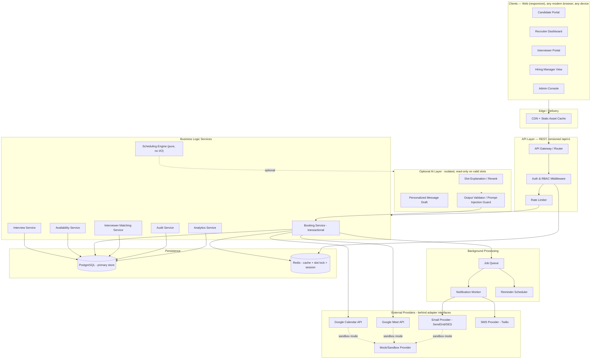
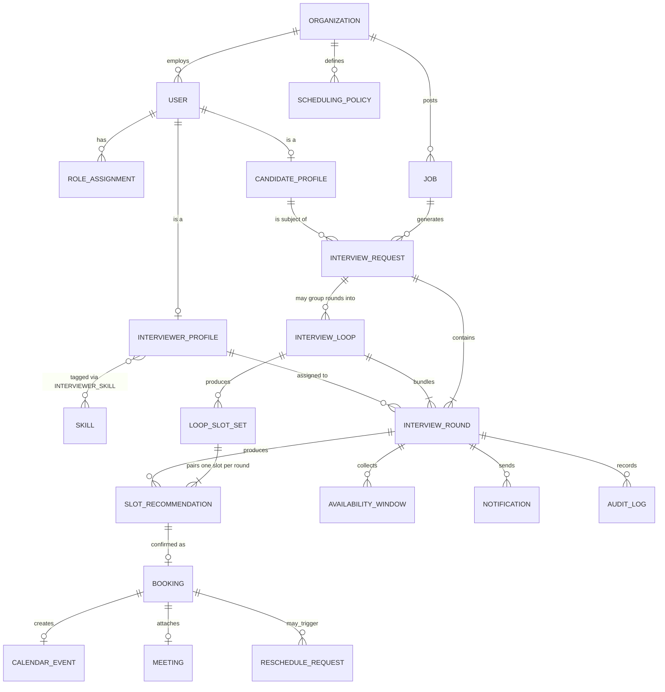
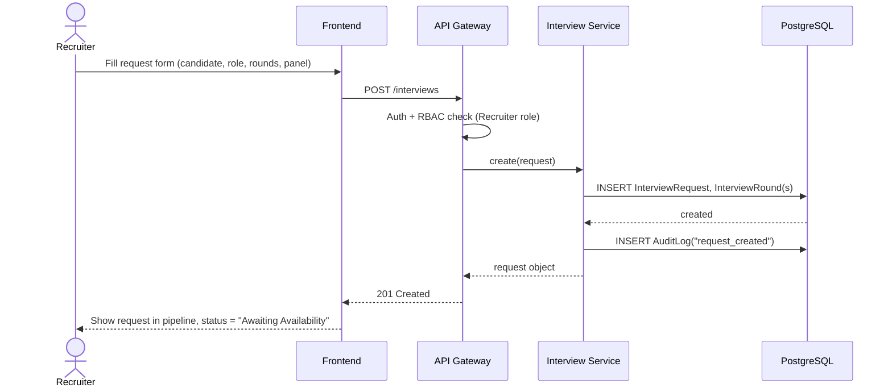
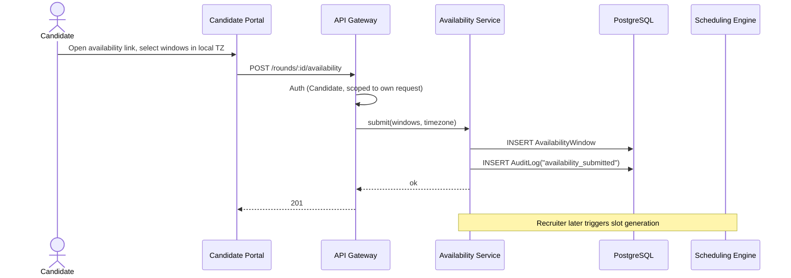
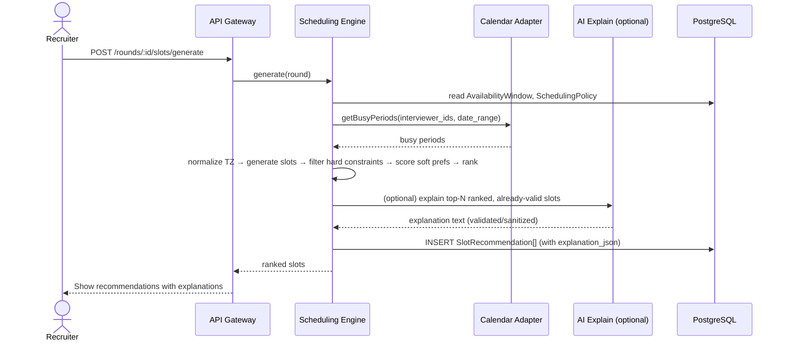
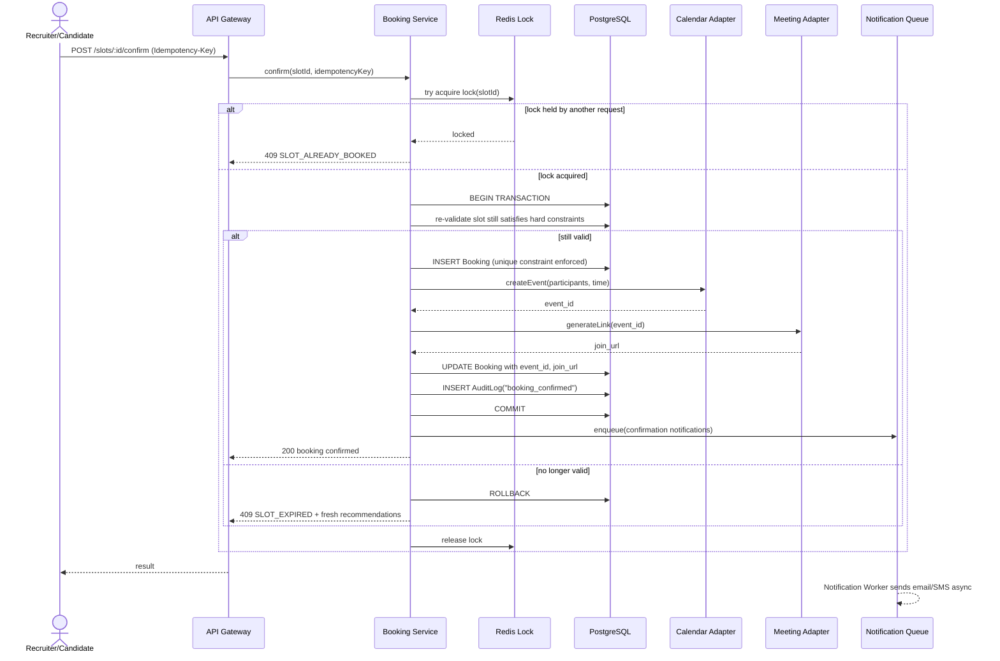
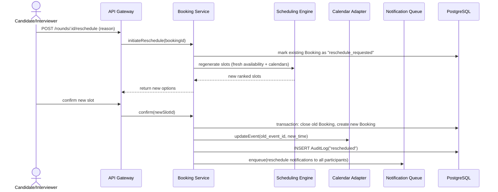
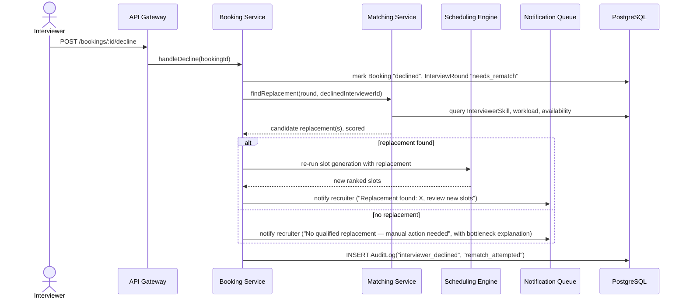
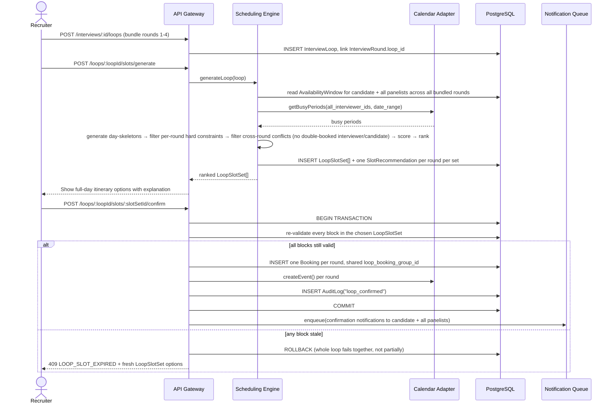
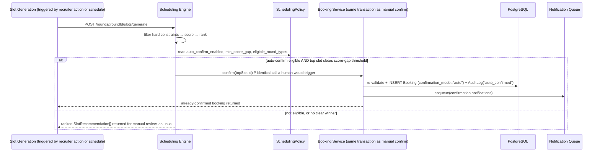

# Smart Interview Scheduler — System Architecture, API Contract & Product Differentiation

**Document type:** Technical architecture + product design reference
**Status:** Pre-implementation design doc
**Owner note:** This document distinguishes *official requirement*, *official bonus*, and *proposed by us* at every section — per the operating rule that functional scope must never be silently invented.

---

## Table of Contents

1. [Problem Re-Analysis](#1-problem-re-analysis)
2. [Why Existing Tools Don't Solve This](#2-why-existing-tools-dont-solve-this)
3. [Our USP & Novelty](#3-our-usp--novelty)
4. [Product Scope: Feature Inventory](#4-product-scope-feature-inventory)
5. [System Architecture](#5-system-architecture)
6. [Data Model](#6-data-model)
7. [API Contract](#7-api-contract)
8. [Scheduling Engine Design](#8-scheduling-engine-design)
9. [Integrations (Email/SMS/Messaging/Calendar/Meeting)](#9-integrations)
10. [Cross-Device & Responsive Strategy](#10-cross-device--responsive-strategy)
11. [Security](#11-security)
12. [Reliability & Failure Handling](#12-reliability--failure-handling)
13. [Scalability Path](#13-scalability-path)
14. [Sequence Diagrams](#14-sequence-diagrams)
15. [Trade-off Log](#15-trade-off-log)

---

## 1. Problem Re-Analysis

### Who actually has this problem
Not "people who need a calendar." Specifically: **a recruiter coordinating N:1:M scheduling** — one candidate, against a *panel* of interviewers, against a *hiring manager's* calendar, across an interview *pipeline* (screen → tech → managerial → HR), where every round has different required attendees, different durations, and a dependency on the previous round's outcome.

### What actually causes the pain (root cause, not symptom)
1. **It's a multi-party constraint satisfaction problem, not a booking problem.** Calendly-style tools solve "one host, one guest, find overlap." They were never built for "5 required attendees, 3 of whom are optional-with-fallback, one of whom just declined."
2. **State lives in email threads.** "Does Tuesday work for everyone?" round-trips across 4 inboxes. There is no single source of truth for *why* a slot was chosen or rejected.
3. **Interviewer supply is a scarce, shared, unfair-to-allocate resource.** The same 3 senior engineers get pulled into every technical round because nothing tracks who's already overloaded.
4. **Failure recovery is manual.** When a panelist declines, a human has to re-derive availability, re-check qualifications, and re-negotiate — today, by hand.
5. **Time zone errors are a silent, high-cost failure mode** — a wrong AM/PM either wastes a senior engineer's hour or costs the company a candidate.

### Personas (recap, unchanged from brief)
Candidate · Recruiter/TA (primary operator) · Hiring Manager · Interviewer/Panelist · Org Admin.

### Official mandatory requirements (baseline — non-negotiable)
Interview request creation · internal availability check · candidate availability collection · automated slot recommendation/booking · calendar event creation · automated communications · conflict detection & rescheduling · RBAC.

### Official bonus
Intelligent interviewer selection · time-zone-aware scheduling · configurable buffer time.

### Additional opportunities explicitly named in the brief
Email/SMS/messaging integration · meeting-link generation · candidate self-service · analytics/audit · responsible AI · Zoom/Meet/Teams integration.

### Evaluation risk factors (what a judge will specifically probe)
- Is scheduling logic actually deterministic, or is an LLM secretly deciding conflicts? (Automatic fail if the latter.)
- Can two people book the same slot? (Concurrency correctness is explicitly tested.)
- Is RBAC enforced server-side, or only hidden in the UI?
- Does the "AI" feature solve a real problem, or is it decorative?

---

## 2. Why Existing Tools Don't Solve This

| Tool category | Example | What it's built for | Where it breaks for interview scheduling |
|---|---|---|---|
| Simple booking links | Calendly, Cal.com | 1 host : 1 guest overlap on a public link | No concept of a *panel*, no hard/soft constraint separation, no interviewer qualification or workload, no multi-round pipeline |
| ATS-embedded scheduling | Greenhouse Scheduling, Lever | Scheduling as a feature bolted onto an applicant tracker | Scheduling logic is a thin availability-grid UI; conflict recovery is "ask the recruiter to try again"; not explainable, not workload-aware |
| Dedicated interview-ops tools | GoodTime, Paradox | Panel scheduling at scale, closest competitor set | Correct problem framing, but proprietary/closed — no visibility into *why* a slot was chosen (black-box ranking), heavy enterprise procurement (not something evaluators can inspect), workload balancing exists but qualification-matching and conflict-bottleneck explanations are not user-facing the way we design them |
| Generic AI chat schedulers | New LLM-wrapper startups | "Ask AI to find a time" | Exactly the anti-pattern this brief warns against: letting an LLM decide whether a conflict exists is unsafe and unauditable |

**The gap we target:** an interview scheduler where every recommendation is *explainable* (which constraints passed, why this beat the alternative), every dead-end is *diagnosable* (which specific participant/rule caused the failure, and the smallest fix), and every allocation is *fair* (interviewer load is a first-class scheduling input, not an afterthought). None of the market leaders expose this reasoning to the end user — they treat the ranking as a black box, exactly the failure mode the brief asks us to avoid.

---

## 3. Our USP & Novelty

| # | Novelty | What it is | Why it's different from market tools | Constraint discipline |
|---|---|---|---|---|
| 1 | **Explainable Scheduling** | Every recommended slot ships a checklist: which hard constraints passed, which soft preferences it wins on, and why it outranked the #2 choice | GoodTime/Greenhouse show a slot; none show *reasoning* | Explanation is generated **from the same constraint object the engine already computed** — it is a rendering of real state, not a separate AI narrative that could be wrong |
| 2 | **Conflict Recovery Engine** | On zero valid slots, names the exact bottleneck ("Panelist B unavailable Tue 2-6pm, candidate only free that window") and proposes the *minimal* relaxation | Competitors show "no slots found" | Relaxation options are computed deterministically (drop one constraint at a time, re-run engine) — AI only phrases the message, never invents the diagnosis |
| 3 | **Fair Workload-Aware Interviewer Matching** | Interviewer selection scores skill-fit × availability × time-zone-fit × (inverse) recent load | GoodTime has load-balancing; we make it transparent and tunable per-org policy | Pure scoring function, unit-testable, no LLM in the decision path |
| 4 | **Constraint-Aware Multi-Round Orchestration** | A pipeline object (Screening→Technical→Managerial→HR) carries forward constraints/dependencies instead of 4 disconnected bookings | ATS tools schedule rounds independently; nothing enforces "don't schedule Managerial before Technical is confirmed" | Dependency graph enforced server-side at request-creation time |
| 5 | **Deterministic-core / AI-periphery architecture** | Scheduling correctness lives entirely in tested, pure functions; AI only ranks-among-valid and drafts messages | Positioned explicitly against "LLM decides if a conflict exists" | Documented data flow: `Availability → Constraint Engine → Valid Slots → Scoring → (optional AI explain/rerank of already-valid, already-ordered set) → Confirm` |
| 6 | **Open, auditable design** | Every scheduling/booking/decline action is in an audit log with before/after state | Enterprise competitors are closed-box SaaS; auditability is a differentiator for compliance-conscious teams | Append-only `AuditLog` table, immutable |
| 7 | **Interview Loop Builder** | Bundles ≥2 rounds (e.g., a 4-stage onsite loop) into one atomic, same-day scheduling operation solved as a single constraint problem (Section 8.1) | Matches GoodTime's signature "multi-day/loop scheduling" capability (confirmed by direct product-video review — Section 2a) — but wraps it in our Explainable/Conflict-Recovery layers, which their equivalent feature does not have | Cross-round conflicts (e.g., an interviewer double-booked across two panels in the same loop) are rejected deterministically at the skeleton-filtering stage, never left to chance |
| 8 | **Zero-Click Auto-Confirm** | Auto-books a slot when it's a clear, policy-eligible winner — same transaction, re-validation, and audit trail as a manual confirm, just no human click | Matches GoodTime's "zero-click scheduling" positioning, but ours is transparently gated (off by default, per-round-type, numeric score-gap threshold visible to the admin) rather than an opaque automation | Never bypasses a hard constraint; only changes *who* clicks confirm (Section 8.2) |
| 9 | **Public Self-Service Booking Links** | A shareable link that puts a candidate directly onto ranked, explainable slots — no separate "submit availability, then wait" round trip when the panel's calendar is already known to be open | Matches GoodTime's "Interview Scheduling Links" product; ours inherits full Explainable Scheduling on the candidate side too, not just a bare calendar grid | Same confirm-transaction and re-validation path as every other booking entry point |
| 10 | **Interview Day Hub** | One page holding the full day's itinerary, meeting links, and interviewer prep notes for a loop, instead of scattering it across per-round tabs | Matches GoodTime's "Interview Center" concept, observed directly in their product-tour video | Read-only aggregation over existing `InterviewLoop`/`Booking` state — no new source of truth |
| 11 | **Post-Interview Scorecard** | A short structured feedback form the interviewer fills immediately after the interview, from the same page as their accept/decline | Inferred from the correspondence/offer-letter panels visible in GoodTime's ATS-embedded candidate view — turns the tool from "books the meeting" into a system that also informs the hiring decision | Feedback data feeds future interviewer-matching quality signals but never itself gates or auto-decides scheduling |
| 12 | **Conversational Scheduling Assistant** | A natural-language front door ("reschedule Meredith's interview to next week," "find a replacement for John") that only ever calls our existing deterministic APIs — reschedule, suggest-replacement, generate-slots | Matches GoodTime's "Cori" AI agent, but ours is structurally barred from ever deciding a conflict itself — it is a UI convenience over real endpoints, not a second decision-maker | Every assistant action is logged in `AuditLog` exactly as if a human had clicked the equivalent button, with the actor tagged as `assistant:<user_id>` — never anonymous |
| 13 | **ATS/HRIS Adapter Pattern** | A generic external-ATS adapter (same interface pattern as Calendar/Meeting/Notification) so the platform can pull candidate/req data from Greenhouse/Lever/SuccessFactors instead of manual entry | GoodTime's entire go-to-market is "we live inside your ATS" — we architect for the same embeddability without building a specific integration for the hackathon (P3, mock/CSV-import implementation only for now) | Adapter boundary means a real ATS integration is additive later, never a rewrite |

**One-sentence USP:** *We are the only interview scheduler that shows its work — every recommendation, every rejection, and every re-match is explainable, auditable, and provably fair, without ever letting AI touch the actual conflict math — while matching the enterprise-grade capabilities (loop scheduling, zero-click confirm, booking links, an AI agent) that today only exist behind a black box.*

### 2a. Competitor UI directly reviewed (research note)
To ground novelty items #7, #9, #10, #12 in real market behavior rather than assumption, GoodTime's own "GoodTime Hire Demo: SuccessFactors + GoodTime" product-tour video was reviewed directly (screenshots captured, chapter-by-chapter). Confirmed: a flat table-based "Interviews" dashboard (Candidate / Status / Interview Name / Date / Updated columns) with **Cancel / Request Availability / Schedule Now** row actions, a top nav of **Dashboard · Scheduling · Interview Center · Insights · Settings**, and — critically — **no visible reasoning anywhere in the UI**: no constraint checklist, no conflict diagnosis, no explanation for why a slot was recommended. This directly confirms the market gap Sections 2 and 3 target: GoodTime has the right problem scope (panel scheduling, loop scheduling, an AI agent) but treats every recommendation as a black box, which is exactly what our Explainable Scheduling and Conflict Recovery Engine are built to fix.

---

## 4. Product Scope: Feature Inventory

Legend: **[OFFICIAL]** mandatory from brief · **[BONUS]** official bonus · **[OURS]** proposed by us, justified.

### 4.1 Core Working Loop — P0 (must work, zero exceptions)
- **[OFFICIAL]** Interview request creation (candidate, job/role, round, type, duration, date range, required panel, constraints)
- **[OFFICIAL]** Internal participant availability retrieval (recruiter, hiring manager, panelists)
- **[OFFICIAL]** Candidate availability collection form
- **[OFFICIAL]** Deterministic slot generation + hard-constraint filtering
- **[OFFICIAL]** Slot recommendation (ranked) with one-click booking
- **[OFFICIAL]** Calendar event creation with all participants attached
- **[OFFICIAL]** Automated notifications: invitation, confirmation, reminder, reschedule, cancellation
- **[OFFICIAL]** Conflict detection + rescheduling workflow
- **[OFFICIAL]** RBAC across 5 roles, enforced server-side

### 4.2 High-Value — P1
- **[BONUS]** Time-zone-aware scheduling (every user sees own local time; UTC storage)
- **[BONUS]** Configurable buffer time (org policy, enforced in-engine)
- **[BONUS]** Intelligent interviewer selection (skills × type × workload × availability)
- **[OURS]** Candidate self-service portal (book / reschedule / cancel own interview within policy)
- **[OURS]** Audit history (append-only timeline per interview)
- **[OURS]** **Public self-service booking links** (Section 3, #9) — candidate lands directly on ranked slots via a shareable link, no separate availability round-trip required when the panel's calendar is already known
- **[OURS]** **Bulk availability request** — recruiter sends availability requests to multiple candidates/rounds in one action instead of one-by-one

### 4.3 Differentiation — P2
- **[OURS]** Explainable Scheduling (Section 3, #1)
- **[OURS]** Conflict Recovery Engine (Section 3, #2)
- **[OURS]** Fair interviewer load balancing (Section 3, #3)
- **[OURS]** Scheduling analytics (time-to-book, conflict rate, reschedule rate, utilization, no-show rate)
- **[OURS]** One reliable meeting-link integration (Google Meet)
- **[OFFICIAL-mentioned-as-opportunity]** Multi-round pipeline orchestration (Section 3, #4)
- **[OURS]** **Interview Loop Builder** — bundle multiple rounds (e.g., a 4-stage onsite loop) into one atomic, same-day scheduling operation instead of scheduling each round independently; see Sections 6.2a and 8.1 for the mechanics
- **[OURS]** **Zero-Click Auto-Confirm** — when the engine finds a single dominant valid slot that clears an org-configured confidence threshold, it books it automatically (still fully re-validated, transactional, and audited) instead of waiting on a human click; see Section 8.2
- **[OURS]** **Interview Day Hub** (Section 3, #10) — one page aggregating a loop's full itinerary, meeting links, and interviewer prep notes
- **[OURS]** **Post-interview scorecard** (Section 3, #11) — lightweight structured feedback form the interviewer fills immediately after, feeding future matching quality signals
- **[OURS]** **Conversational Scheduling Assistant** (Section 3, #12) — natural-language front door restricted to calling existing deterministic endpoints only (reschedule, suggest-replacement, generate-slots); every action it takes is audit-logged under `assistant:<user_id>`, never anonymous

### 4.4 Forward-Compatible Architecture — P3 (scoped as future work by design, not deprioritized as unimportant — building a real external integration for each of these is explicitly out of hackathon time budget; the adapter boundary exists now specifically so none of this requires a rewrite later)
- **[OURS]** **ATS/HRIS adapter pattern** (Section 3, #13) — generic external-ATS interface (Greenhouse/Lever/SuccessFactors); mock/CSV-import implementation only for the hackathon
- **[OURS]** Multiple meeting providers (Zoom, Teams) behind the same adapter interface
- **[OURS]** SMS via Twilio in addition to email
- **[OURS]** Slack/Teams messaging notifications
- **[OURS]** Multi-region deployment
- **[OURS]** Advanced ranking (ML-learned soft-preference weights from historical acceptance data)

### 4.5 Cross-cutting / platform features
- **[OFFICIAL]** Authentication: email/password + Google OAuth (practical subset — not 5 half-working methods)
- **[OFFICIAL]** RBAC: Candidate, Interviewer, Recruiter, Hiring Manager, Admin
- **[OURS]** Fully responsive UI: desktop, tablet, mobile — every core flow (including candidate booking and interviewer accept/decline) usable one-handed on a phone, since candidates and interviewers frequently act from mobile/email links
- **[OURS]** Demo/Sandbox mode with mock calendar+meeting+notification adapters, so the judged demo never depends on live third-party uptime, while DB writes/state transitions/validation remain fully real

---

## 5. System Architecture

### 5.1 High-level component diagram



### 5.2 Why each layer exists

| Layer | Why it's a separate piece |
|---|---|
| CDN | Static frontend assets served close to the user; keeps API servers focused on logic, not asset bytes |
| API Gateway + Auth middleware | Single choke point for RBAC — every request is authorized **before** it reaches a service, never trusted from the client |
| Rate limiter | Protects booking/notification endpoints from rapid-click / retry storms (explicit edge case in the brief) |
| Scheduling Engine as a pure module | The single most safety-critical piece of logic — kept free of DB/network calls so it's unit-testable in isolation and cannot silently depend on AI |
| Booking Service (transactional) | Owns the only code path allowed to write a `confirmed` booking; wraps re-validation + calendar write + notification enqueue in one DB transaction |
| AI layer, isolated | Structurally cannot touch the DB or decide conflicts — it only receives an already-ranked, already-valid slot list and either explains it or reorders within it; output passes through a validator before ever reaching a user |
| Job Queue + Workers | Notification/reminder delivery is decoupled from the booking transaction — a slow email provider must never block a user's booking confirmation |
| Redis | Two narrow uses only: (a) a short-lived lock/idempotency key during slot confirmation to close the double-booking race window before the DB constraint is even hit, (b) session/rate-limit counters. Not used as a system of record. |
| Adapter interfaces (Calendar/Meeting/Notification) | Lets the same application logic run against Google's real API or a Mock provider — the demo is never at the mercy of an OAuth hiccup during judging |

### 5.3 Request flow (text form, for the walkthrough)

```
Client → CDN (static) / API Gateway (data)
API Gateway → Auth middleware (verify JWT, resolve role) → Rate limiter
→ Route to Service → Service reads/writes PostgreSQL (+Redis where noted)
→ Booking confirmations enqueue a Notification job → Worker sends via Email/SMS adapter
→ Every state-changing action also writes one AuditLog row
```

---

## 6. Data Model

### 6.1 Entities & relationships (ER summary)



> **Reading the loop entities:** `InterviewLoop` is optional — most interviews (a single screening call, say) never create one; it exists only when a recruiter explicitly bundles ≥2 rounds into one same-day, one-click scheduling operation. `LoopSlotSet` is the engine's output for a loop — a *combination* of one slot per bundled round that together satisfy every round's constraints plus inter-round buffer/ordering — and confirming a `LoopSlotSet` creates one `Booking` per round, all tagged with the same `loop_booking_group_id` so they can be reasoned about (and, if needed, rolled back) as a unit.

### 6.2 Key tables and why they exist

| Entity | Purpose | Notable constraints/indexes |
|---|---|---|
| `Organization` | Tenant isolation root | All child tables carry `organization_id`; every query filtered by it (multi-tenant safety) |
| `User` | Auth identity | `unique(email)`, `unique(org_id, external_oauth_id)` |
| `RoleAssignment` | RBAC | `(user_id, role)` — a user can hold multiple roles (e.g., Hiring Manager who also interviews) |
| `CandidateProfile` / `InterviewerProfile` | Role-specific attributes | 1:1 with `User` |
| `Skill` / `InterviewerSkill` | Matching input | `InterviewerSkill(interviewer_id, skill_id, proficiency)` — composite PK |
| `Job` | Requisition context | `org_id, title, department` |
| `InterviewRequest` | The recruiter's ask | `candidate_id, job_id, status`, holds pipeline metadata |
| `InterviewRound` | One round within a request | `request_id, round_type (screening/technical/managerial/hr), duration_minutes, sequence_order, loop_id (nullable)` — **enforces pipeline ordering**; `loop_id` set only when the round is part of a bundled loop |
| `InterviewLoop` | **[NEW]** Groups ≥2 rounds into one atomic, same-day scheduling unit (Section 4.3, 8.1) | `request_id, candidate_id, target_date_range, status (draft/generating/awaiting_confirm/confirmed/cancelled)` |
| `LoopSlotSet` | **[NEW]** One engine-generated *combination* of per-round slots for a loop, kept even when not chosen (auditability, same principle as `SlotRecommendation`) | `loop_id, score, explanation_json, rank`; joins to `SlotRecommendation` via a `loop_slot_set_id` FK on each round's recommendation row |
| `AvailabilityWindow` | Raw input from candidate/interviewer | `owner_id, owner_type, start_utc, end_utc, timezone_at_entry` |
| `CalendarEvent` | Cached busy-periods + created events | `provider, external_event_id, start_utc, end_utc` |
| `SchedulingPolicy` | Org rules | `buffer_minutes, working_hours_start/end, max_interviews_per_day_per_interviewer, auto_confirm_enabled (bool), auto_confirm_min_score_gap (float), auto_confirm_eligible_round_types (array)` — the last three gate Zero-Click Auto-Confirm (Section 8.2) |
| `SlotRecommendation` | Engine output, pre-booking | `round_id, loop_slot_set_id (nullable), start_utc, end_utc, score, explanation_json, rank` — kept even for non-chosen slots (auditability) |
| `Booking` | The confirmed reality | **`unique(slot_id) where status='confirmed'`** — this single constraint is the last-line defense against double booking. Also carries `confirmation_mode (manual/auto)` and `loop_booking_group_id (nullable)` — the latter ties together every `Booking` row created from one `LoopSlotSet` confirm so the whole loop can be reasoned about (and reschedule-cascaded) as a unit |
| `Meeting` | Generated meeting link | `provider, join_url, external_meeting_id` |
| `RescheduleRequest` | Reschedule workflow state | `booking_id, requested_by, reason, status` |
| `Notification` | Delivery record | `channel (email/sms), template, status (queued/sent/failed), retry_count` |
| `AuditLog` | Immutable history | `entity_type, entity_id, action, actor_id, before_state, after_state, created_at` — append-only, never updated/deleted |

### 6.3 Concurrency-critical constraint

```sql
-- The single DB-level guarantee that makes double-booking structurally impossible,
-- independent of application-layer bugs:
CREATE UNIQUE INDEX uq_booking_confirmed_slot
  ON booking (slot_recommendation_id)
  WHERE status = 'confirmed';
```
Combined with a `SELECT ... FOR UPDATE` on the slot row inside the booking transaction, plus a short Redis lock keyed by `slot_id` to fail fast before even hitting Postgres under a burst of duplicate clicks.

---

## 7. API Contract

Base path: `/api/v1`. All endpoints (except `/auth/*` and public booking-link resolution) require `Authorization: Bearer <jwt>`, resolved to `(user_id, org_id, roles[])` by the auth middleware. All responses use a standard envelope: `{ data, error, meta }`.

### 7.1 Auth
| Method | Path | Auth | Notes |
|---|---|---|---|
| POST | `/auth/signup` | none | email/password |
| POST | `/auth/login` | none | returns access + refresh token |
| GET | `/auth/oauth/google` | none | redirect to Google OAuth |
| GET | `/auth/oauth/google/callback` | none | exchanges code, creates/links user |
| POST | `/auth/refresh` | refresh token | rotates tokens |
| POST | `/auth/logout` | session | revokes refresh token |
| GET | `/auth/me` | session | current user + roles |
| POST | `/auth/forgot-password` | none | accepts email, always returns a generic success message (no user enumeration); enqueues reset email if account exists |
| POST | `/auth/reset-password` | reset token (URL param) | body: new password; token single-use, short TTL |

### 7.2 Users
| Method | Path | Role | Notes |
|---|---|---|---|
| GET | `/users/:id` | self/Admin/Recruiter | profile |
| PATCH | `/users/:id` | self/Admin | update profile |
| GET | `/users` | Recruiter/Admin | search/list users, filter by `role=candidate\|interviewer`, `q=<name/email>` — backs candidate search in Create Interview and interviewer search in panel selection |
| GET | `/users/:id/skills` | any | interviewer skill list |
| PUT | `/users/:id/skills` | self(Interviewer)/Admin | replace skill set |
| GET | `/users/:id/availability` | self/Recruiter/Admin | interviewer working hours + windows |
| PUT | `/users/:id/availability` | self/Admin | set recurring working hours + exceptions |
| PATCH | `/users/:id/notification-preferences` | self | per-channel (email/SMS) opt-in per notification type |

### 7.3 Interviews
| Method | Path | Role | Notes |
|---|---|---|---|
| POST | `/interviews` | Recruiter | create `InterviewRequest` (+ initial rounds) |
| GET | `/interviews/:id` | Recruiter/HM/Admin/Candidate(own)/Interviewer(assigned) | full detail, RBAC field-filtered |
| GET | `/interviews` | Recruiter/HM/Admin | list/filter (status, candidate, job, date range) |
| PATCH | `/interviews/:id` | Recruiter | update request-level fields |
| DELETE | `/interviews/:id` | Recruiter/Admin | soft-cancel, cascades to rounds |
| POST | `/interviews/:id/rounds` | Recruiter | add a round to the pipeline |
| PATCH | `/interviews/:id/rounds/:roundId` | Recruiter | update round (duration, panel, type) |
| GET | `/jobs` | Recruiter/Admin | org-scoped job/role listing, backs the Job select in Create Interview step 1 |
| POST | `/jobs` | Recruiter/Admin | create a job/role record (minimal — title, department) |
| GET | `/interviewers/suggest` | Recruiter | query params `round_id` (or `skills[]`, `interview_type`, `date_range`); wraps the Interviewer Matching Service to pre-populate qualified, load-balanced candidates in the panel-selection step — read-only, never assigns |
| POST | `/interviews/:id/loops` | Recruiter | create an `InterviewLoop` bundling ≥2 existing rounds from this request into one atomic scheduling unit — see 7.4a |

### 7.4 Scheduling
| Method | Path | Role | Notes |
|---|---|---|---|
| POST | `/rounds/:roundId/availability` | Candidate/Interviewer | submit availability windows |
| GET | `/rounds/:roundId/availability` | Recruiter/HM/Admin | aggregated view |
| POST | `/rounds/:roundId/slots/generate` | Recruiter (system-triggered) | run constraint engine → `SlotRecommendation[]`. If the round's `SchedulingPolicy` has `auto_confirm_enabled` and the top slot clears `auto_confirm_min_score_gap` over the #2 slot, the engine internally calls the same confirm path used by `POST .../confirm` — see 8.2 — and this endpoint returns the *already-confirmed* booking instead of a pending recommendation list |
| GET | `/rounds/:roundId/slots` | Recruiter/Candidate | ranked slots + explanation |
| POST | `/rounds/:roundId/slots/:slotId/confirm` | Recruiter/Candidate | **idempotent** (client sends `Idempotency-Key` header); triggers booking transaction; response includes `confirmation_mode: "manual"` |
| POST | `/rounds/:roundId/reschedule` | Recruiter/Candidate/Interviewer | starts reschedule workflow, re-runs engine |

### 7.4a Interview Loops (Loop Builder — Section 8.1)
| Method | Path | Role | Notes |
|---|---|---|---|
| GET | `/loops/:loopId` | Recruiter/HM/Admin/Candidate(own)/Interviewer(assigned) | loop detail: bundled rounds, status, itinerary if confirmed |
| POST | `/loops/:loopId/slots/generate` | Recruiter | runs the loop-aware engine (Section 8.1) → `LoopSlotSet[]`, each pairing one valid slot per bundled round with correct inter-round buffers |
| GET | `/loops/:loopId/slots` | Recruiter/Candidate | ranked `LoopSlotSet[]` + explanation (aggregated across all bundled rounds) |
| POST | `/loops/:loopId/slots/:slotSetId/confirm` | Recruiter/Candidate | **idempotent**; atomically creates one `Booking` per bundled round (all sharing one `loop_booking_group_id`), or rolls back entirely if any round's slot has gone stale since generation — the loop is booked as a whole or not at all |
| POST | `/loops/:loopId/reschedule` | Recruiter/Candidate/Interviewer | re-runs the whole loop (not just one round) — used when any bundled round needs to move, since a mid-loop change usually invalidates buffers for adjacent rounds too |
| GET | `/rounds/:roundId/conflict-report` | Recruiter | Conflict Recovery Engine output when zero valid slots |

### 7.5 Interviewer response
| Method | Path | Role | Notes |
|---|---|---|---|
| POST | `/bookings/:id/decline` | Interviewer | triggers re-match workflow |
| POST | `/bookings/:id/accept` | Interviewer | explicit confirmation (optional, if org policy requires) |
| GET | `/interviewers/me/upcoming` | Interviewer | dashboard feed |
| GET | `/interviewers/me/workload` | Interviewer/Admin | interviews-per-week metric |

### 7.6 Calendar & Meeting
| Method | Path | Role | Notes |
|---|---|---|---|
| POST | `/calendar/connect` | self | OAuth-connect Google Calendar |
| DELETE | `/calendar/disconnect` | self | revoke |
| GET | `/calendar/busy` | internal (service-to-service) | fetch busy periods for a user in a range |
| POST | `/calendar/events` | internal | create event (called only by Booking Service) |
| PATCH | `/calendar/events/:id` | internal | update on reschedule |
| DELETE | `/calendar/events/:id` | internal | cancel |
| POST | `/meetings` | internal | generate meeting link (Meet adapter) |

### 7.7 Notifications
| Method | Path | Role | Notes |
|---|---|---|---|
| POST | `/notifications/invite` | internal | queued by Booking Service |
| POST | `/notifications/confirm` | internal | |
| POST | `/notifications/reminder` | internal (cron-triggered) | 24h / 1h before |
| POST | `/notifications/reschedule` | internal | |
| GET | `/notifications` | Recruiter/Admin | delivery status list, for debugging |

### 7.8 Analytics & Audit
| Method | Path | Role | Notes |
|---|---|---|---|
| GET | `/analytics/scheduling` | Recruiter/HM/Admin | time-to-book, success rate |
| GET | `/analytics/conflicts` | Recruiter/HM/Admin | conflict rate, top bottleneck causes |
| GET | `/analytics/workload` | HM/Admin | per-interviewer utilization |
| GET | `/audit?entity_type=&entity_id=` | Recruiter/Admin | immutable action history |

### 7.9 Admin
| Method | Path | Role | Notes |
|---|---|---|---|
| GET/POST | `/admin/users` | Admin | user + role management |
| GET/PUT | `/admin/policy` | Admin | working hours, buffer, org scheduling rules, **and Zero-Click Auto-Confirm settings** (`auto_confirm_enabled`, `auto_confirm_min_score_gap`, `auto_confirm_eligible_round_types`) — Auto-Confirm is off by default and must be explicitly opted into per round type |
| GET/POST | `/admin/integrations` | Admin | provider connection status |
| GET | `/admin/skills` | Admin | org-wide skill taxonomy list |
| POST | `/admin/skills` | Admin | add a new skill tag to the taxonomy |
| DELETE | `/admin/skills/:id` | Admin | remove a skill tag (blocked if in use — returns `409 SKILL_IN_USE`, doesn't silently orphan `InterviewerSkill` rows) |

### 7.10 API Cost Summary — what's actually free vs. paid

Every external API this system integrates with, and what it costs to run in a real deployment (not just the hackathon demo):

| Provider | Endpoint used for | Free tier | Paid pricing beyond free tier | Our usage tier for this project |
|---|---|---|---|---|
| **Google Calendar API** | `freebusy.query`, `events.insert/update/delete` | **Free** — no cost for API calls themselves; subject to a generous default quota (1,000,000 queries/day per project) | Effectively unlimited for our scale — Google doesn't charge per-call for Calendar API | Free tier is sufficient indefinitely at hackathon/small-org scale |
| **Google Meet (via Calendar `conferenceData`)** | Meeting link generation on event create | **Free** — Meet links are generated as a side effect of a free Calendar API call | No separate charge; a *paid* Google Workspace plan is only needed if the organization wants premium Meet features (recording, larger call caps) — not required for link generation | Free |
| **Google OAuth2** | Sign-in / calendar connect | **Free** | N/A | Free |
| **Email (SendGrid)** | Invitations, confirmations, reminders | **Free** — 100 emails/day forever (SendGrid free plan) | Paid plans start ~$19.95/mo for 50k emails/month once volume grows | Free tier covers the hackathon demo and small pilot use comfortably |
| **Email (AWS SES, alternative)** | Same, if chosen instead of SendGrid | **Free** — 62,000 emails/month free if sent from an EC2/Lambda-hosted app; otherwise ~$0.10 per 1,000 emails | Pay-as-you-go, no minimum | Cheapest at any real scale; SendGrid is easier to set up for a hackathon |
| **SMS (Twilio)** | Reminders/confirmations via SMS (P1/P2 stretch) | **Trial credit only** (~$15 one-time trial credit, sends carry a "Sent from a Twilio trial account" prefix) — **no ongoing free tier** | Pay-per-message: ~$0.0079/SMS in the US (varies by country/carrier), plus a monthly number lease (~$1.15/mo) | Paid at any real usage — this is the one integration that is **not free in production**; keep SMS as an explicitly opt-in, lower-priority channel behind email |
| **Anthropic Claude API (optional AI layer: explanation/rerank/message drafting)** | Slot explanation text, personalized message drafts | No free tier for production API use (separate from any UI free tier) | Pay-per-token (varies by model — use the smallest capable model, since this layer only ever explains/drafts, never decides constraints, so token volume is tiny) | Paid, but usage is minimal by design — a few short completions per booking, not a chat loop |
| **PostgreSQL / Redis hosting** | Primary data store, cache/lock | Free tiers exist on most platforms (Render, Railway, Supabase, Neon) at hackathon scale | Paid tiers scale with storage/connections | Free tier sufficient for demo + early pilot |
| **Hosting (frontend + API)** | App deployment | Free tiers on Vercel/Render/Railway | Paid once traffic/build-minutes exceed free quota | Free tier sufficient for demo |

**Bottom line for the pitch:** the entire mandatory feature set (Calendar, Meet, Email, Auth, hosting) can run on **$0/month** at hackathon and early-pilot scale. The only line item that costs money from day one is **SMS**, which is why it's designed as an optional, user-opt-in channel layered on top of email rather than a required part of the core loop — the product's P0 loop has zero mandatory paid dependencies.

### 7.11 Error format (consistent across all endpoints)
```json
{
  "data": null,
  "error": { "code": "SLOT_ALREADY_BOOKED", "message": "This slot was just booked by another user.", "retryable": true },
  "meta": { "request_id": "..." }
}
```
Idempotency: all state-changing POSTs on the booking path accept `Idempotency-Key`; duplicate key within a TTL window returns the original result rather than re-executing.

---

## 8. Scheduling Engine Design

Pure function pipeline, no side effects, fully unit-testable:

```
normalize_timezones(candidate_windows, interviewer_windows) 
  → generate_candidate_slots(date_range, duration)
  → filter_hard_constraints(slots, availability, working_hours, buffer, existing_events)
  → score_soft_preferences(valid_slots, preferences, workload)
  → rank(scored_slots)
  → [optional] ai_explain_or_rerank(ranked_slots)   // never introduces new slots, never removes valid ones
  → present_top_n
```

**Hard constraints (must pass, no exceptions):** candidate availability · required interviewer availability · working hours · time zone correctness · interview duration fit · buffer compliance · no overlap with existing confirmed events · org scheduling rules.

**Soft preferences (ranking only):** candidate's preferred window · interviewer's preferred window · earliest feasible time · minimized interviewer idle/fragmentation · workload balance · avoid very early/late local time.

**Re-check before commit:** immediately before writing `Booking`, the engine re-runs the hard-constraint check against current calendar state (not the possibly-stale state from when slots were generated) — this closes the "someone else booked in the meantime" gap in addition to the DB unique constraint.

### 8.1 Interview Loop Builder — multi-round atomic scheduling

A loop is not "run the single-round pipeline N times and hope the results don't collide" — that would let round 2's chosen time overlap round 1's buffer, or double-book an interviewer who sits on two panels in the same loop. Instead, the loop pipeline treats the **whole day as one constraint problem**:

```
normalize_timezones(candidate_windows, all_interviewer_windows_across_rounds)
  → generate_candidate_day_skeletons(date_range, [round_1_duration, round_2_duration, ...], inter_round_buffer)
      // a "day skeleton" is one full ordered sequence of back-to-back time blocks for ALL bundled rounds
  → filter_hard_constraints_per_block(skeleton, availability, working_hours, buffer, existing_events)
      // every block in a skeleton must independently satisfy its own round's hard constraints
  → filter_cross_round_conflicts(skeleton)
      // reject any skeleton where the same interviewer (or the candidate) is double-booked across two blocks,
      // or where total same-day interview time exceeds SchedulingPolicy.max_interviews_per_day_per_interviewer
  → score_soft_preferences(valid_skeletons, preferences, workload, fragmentation)
      // an additional loop-specific soft preference: minimize candidate total on-site/on-call time end-to-end
  → rank(scored_skeletons)
  → [optional] ai_explain_or_rerank(ranked_skeletons)
  → present_top_n as LoopSlotSet[]
```

**Why this must be one pipeline, not N separate ones:** the per-round engine has no visibility into what round 1 already claimed. Running it independently per round is *exactly* the bug class that produces "Interviewer X is double-booked at 2pm across two panels" — a real, named failure mode this architecture is specifically designed to make structurally impossible, not just unlikely.

**Confirming a loop:** `POST /loops/:loopId/slots/:slotSetId/confirm` opens a single DB transaction that re-validates every block in the chosen `LoopSlotSet` (same re-check-before-commit discipline as a single booking), then inserts one `Booking` row per round, all sharing a `loop_booking_group_id`. If any one block has gone stale (e.g., an interviewer's calendar changed since generation), the **entire transaction rolls back** — the loop books as a whole or not at all, so a candidate is never left with a confirmed round 1 and a silently-failed round 3.

### 8.2 Zero-Click Auto-Confirm — bounded, deterministic, reversible

Auto-Confirm is **not** a separate, looser code path — it reuses the exact same booking transaction, re-validation, unique constraint, and audit logging as a manual confirm. The only difference is *who* clicks confirm:

```
after rank(scored_slots):
  if org.SchedulingPolicy.auto_confirm_enabled
     and round.round_type in SchedulingPolicy.auto_confirm_eligible_round_types
     and (top_slot.score - second_slot.score) >= SchedulingPolicy.auto_confirm_min_score_gap:
        → call the SAME confirm(topSlot.id) transaction used by the manual endpoint
        → Booking.confirmation_mode = "auto"
        → AuditLog records "auto_confirmed" (distinct action from "booking_confirmed" so it's always
          distinguishable in the audit trail which bookings had no human in the loop)
  else:
        → present ranked slots for manual confirmation, as usual
```

**Guardrails, by design:**
- **Off by default**, opt-in per organization *and* per round type (a company might trust auto-confirm for Screening calls but never for a Managerial round) — set in `SchedulingPolicy` via `PUT /admin/policy`.
- The **score-gap threshold** (`auto_confirm_min_score_gap`) is a plain numeric comparison over the same deterministic scores the ranking already computed — this is not a new AI decision, it's a policy-configurable strictness dial over existing, tested math.
- **Never overrides a hard constraint** — auto-confirm only ever fires on a slot that already passed every hard constraint in the normal pipeline; it changes who clicks "confirm," never what counts as valid.
- **Fully reversible** — an auto-confirmed booking is a normal `Booking` row; reschedule/cancel/decline flows treat it identically to a manually confirmed one, with `confirmation_mode` visible in the UI and audit trail so nothing about its origin is hidden.

---

## 9. Integrations

| Integration | Priority | Approach |
|---|---|---|
| Google Calendar | **[OFFICIAL]** primary | OAuth2, `freebusy.query` for availability, `events.insert/update/delete` for booking — behind `CalendarProvider` interface |
| Google Meet | **[OURS]** one reliable integration | Generated via Calendar event's `conferenceData` at booking time — no separate Zoom/Teams integration for the MVP demo, kept behind `MeetingProvider` interface so a second provider is a pure adapter addition, not a rewrite |
| Email | **[OFFICIAL]** primary notification channel | SendGrid or SES; templated (invite/confirm/reminder/reschedule/cancel) |
| SMS | **[OURS]** P1/P2 stretch | Twilio; same notification worker, different channel — only sent if user opts in and phone is verified |
| Messaging (Slack/Teams) | **[OURS]** P3 | Same adapter pattern, added only if time permits — never faked as "coming soon" in the UI; simply hidden if not built |

**Adapter pattern (why):** every external provider implements a small interface (`getBusyPeriods`, `createEvent`, `send`), with a `Mock` implementation used in Sandbox/Demo Mode. This is the concrete mechanism behind "the demo never depends on live third-party uptime" — swapping Google's real API for the mock is a config flag, not a code change.

---

## 10. Cross-Device & Responsive Strategy

- Single responsive React codebase (not separate mobile app) — breakpoints for mobile / tablet / desktop.
- Candidate and Interviewer flows (availability submission, accept/decline, booking confirmation) are the ones most likely opened from a phone via an email link — designed mobile-first, verified at 375px width before desktop.
- Recruiter dashboard and Analytics are desktop-optimized first (data-dense) but must not break/overflow on tablet.
- No horizontal scroll on any breakpoint; calendar/slot-grid components collapse to a stacked list view under 640px rather than a cramped grid.
- Keyboard navigation + focus states + ARIA labels on all interactive elements (accessibility is not device-specific but is verified across form factors, including touch targets ≥44px on mobile).

---

## 11. Security

- **AuthN**: email/password (bcrypt/argon2 hashed) + Google OAuth2; JWT access token (short TTL) + rotating refresh token (httpOnly, secure cookie).
- **AuthZ**: RBAC resolved server-side on every request; never inferred from client-sent role claims alone — role checked against `RoleAssignment` table per request.
- **Input validation**: schema validation (e.g., Zod/Pydantic) at every API boundary; reject unknown fields.
- **Secrets**: environment variables only; no secrets in the repo; `.env.example` documents required keys without values.
- **CORS**: allow-list of known frontend origins only.
- **Rate limiting**: per-user + per-IP on auth and booking-confirmation endpoints specifically (these are the rapid-click / abuse-prone ones).
- **Safe logging**: no PII (candidate email/phone, tokens) in logs; structured logs with IDs only.
- **AI-specific**: prompts to the message-drafting/explanation layer include only the structured scheduling facts needed (slot time, constraint names) — never full candidate profile or interviewer PII beyond first name; all AI output passed through a validator/sanitizer before rendering (defends against prompt injection via, e.g., a candidate-entered "reason for reschedule" free-text field being echoed into a prompt).
- **Multi-tenant isolation**: every query scoped by `organization_id`; verified via integration tests that cross-org access returns 404, not 403 (to avoid leaking existence).

---

## 12. Reliability & Failure Handling

| Failure | Handling |
|---|---|
| Calendar API timeout/down | Retry with backoff (bounded); on exhaustion, surface a clear "calendar sync delayed" state and fall back to Mock provider in Sandbox Mode |
| Email/SMS send failure | Retried by the worker (bounded attempts), status tracked in `Notification.status`; booking itself is **not** rolled back — a failed notification is a visible warning, not a lost booking |
| Concurrent booking of same slot | DB unique constraint + row lock + Redis pre-check (Section 6.3) — loser gets a clean "already booked, here are alternatives" response |
| Interviewer declines | Triggers Matching Service re-run scoped to the same round; recruiter notified either way (auto-replacement or "no replacement found") |
| Expired scheduling link / stale slot list | Slots carry a TTL; confirming a stale slot re-validates and returns `SLOT_EXPIRED` with fresh recommendations, not a silent failure |
| Invalid input (empty fields, bad dates, duration > window) | Rejected at API validation layer with field-level error messages, never reaches the engine |
| Rapid duplicate clicks | Idempotency-Key on booking POST; UI also disables the button optimistically pending response |

---

## 13. Scalability Path

Explicitly **not** built for the hackathon, but the credible path:
- Stateless API servers → horizontal scale-out behind a load balancer.
- Postgres read replicas for availability/analytics queries; writes stay on primary.
- Redis promoted from single-node to a managed cluster if session/lock volume grows.
- Notification worker becomes a proper queue (SQS/Cloud Tasks) once volume exceeds a single-process worker's throughput.
- CDN + regional API deployment if candidate/interviewer base goes multi-region; time zone handling already assumes UTC storage so this requires no data migration.
- **What breaks first at 100K users:** the booking confirmation write path on a single Postgres primary — addressed by read replicas first, then by organization-based sharding only if actually needed (not pre-built).

---

## 14. Sequence Diagrams

### 14.1 Interview Request Creation


### 14.2 Candidate Availability Submission


### 14.3 Slot Generation & Ranking


### 14.4 Booking Confirmation (with concurrency protection)


### 14.5 Rescheduling


### 14.6 Interviewer Decline → Auto Re-match


### 14.7 Interview Loop Scheduling (multi-round, atomic)


### 14.8 Zero-Click Auto-Confirm


---

## 15. Trade-off Log

| Decision | Alternative(s) considered | Why chosen | Cost | What changes at scale |
|---|---|---|---|---|
| PostgreSQL | MongoDB, DynamoDB | Domain is relational (users↔orgs↔interviews↔bookings); need real transactions + unique constraints for double-booking prevention | Less flexible schema evolution than NoSQL | Add read replicas; consider partitioning by `organization_id` only if a single org's data volume becomes the bottleneck |
| REST | GraphQL | Small fixed client set, domain-oriented endpoints are easy to reason about and defend in a walkthrough | Slight over-fetching on some dashboard views | Could introduce a BFF/GraphQL layer later if client diversity grows (native apps, partner integrations) |
| Modular monolith | Microservices | One deployable is faster to build/debug/demo in hackathon timeframe; Scheduling Engine is already isolated as a pure module, capturing most of the benefit of a service boundary without the operational cost | Less independent scalability per component | Split Scheduling Engine and Notification Worker into separate deployables first, once their load profiles diverge from the API's |
| Deterministic engine + optional AI | Full LLM-driven scheduling | Brief explicitly requires hard constraints never be overridden by AI; deterministic logic is auditable and testable | AI's contribution is narrower (explain/rerank only) | Unchanged at scale — this is a correctness boundary, not a performance one |
| Adapter interfaces for Calendar/Meeting/Notification | Direct SDK calls inline | Demo reliability (swap to Mock instantly) + future multi-provider support without rewriting business logic | Extra interface layer to maintain | Add real Zoom/Teams/SMS implementations behind the same interfaces as needed |
| Redis for lock + cache only (not system of record) | Redis as primary store, or no cache at all | Narrow, justifiable use (closing the double-booking race window fast) without taking on Redis as a durability dependency | One more moving part in local dev | Promote to managed Redis cluster if lock/session volume grows |
| Queue-based notifications | Synchronous send during booking request | Booking confirmation must not block on/fail because of a slow email provider | Slight delay before user sees "email sent" | Swap in-process/Redis queue for SQS/Cloud Tasks under real load |
| Loop as a first-class entity (`InterviewLoop`/`LoopSlotSet`) | Model a loop as "just several rounds that happen to share a date," coordinated only in the UI | A UI-only convention can't stop the engine from independently double-booking an interviewer across two rounds in the same loop, since each round's pipeline has no visibility into the other's picks — making it a first-class entity is what lets the engine solve the whole day as one constraint problem (Section 8.1) | One more pair of tables and a small amount of extra join complexity in slot generation | Unchanged at scale — this is a correctness boundary (same category as the deterministic-engine decision above), not a performance one |
| Auto-Confirm reuses the manual booking transaction, gated by policy | A separate "fast path" booking function for auto-confirm | Reusing the exact same re-validation/transaction/audit code as manual confirm means auto-confirm can never be *less* safe than a human clicking the button — it only changes who clicks it, never what's allowed to be booked | Org must explicitly opt in per round type; won't auto-book anything by default, so it adds no value until configured | Unchanged at scale — the score-gap threshold is a cheap deterministic comparison, not a scaling concern |

---

*End of document. This file is a design reference — implementation should follow Phase order in the master build prompt (Audit → Plan → Design System → Backend → Scheduling Engine → Frontend → Integrations → Polish → Test → Fix → Document → Demo).*
